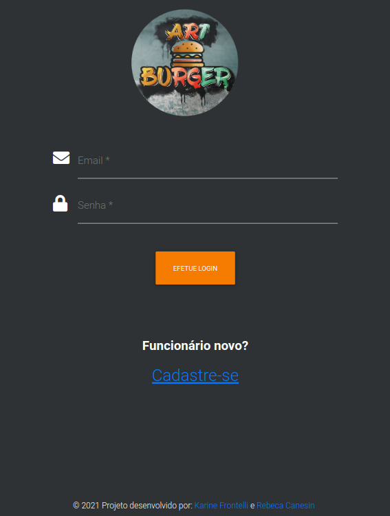
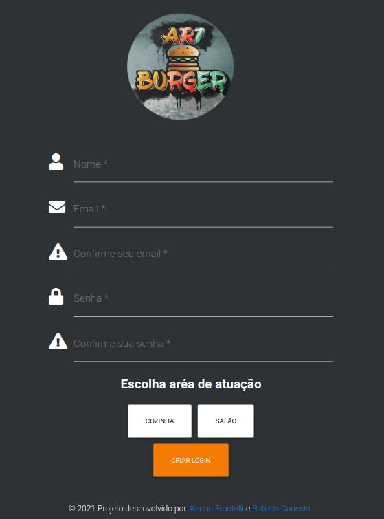
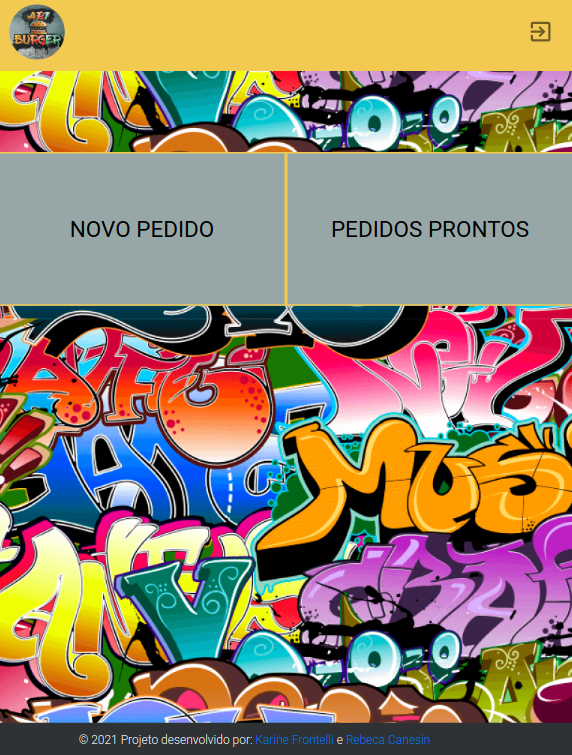
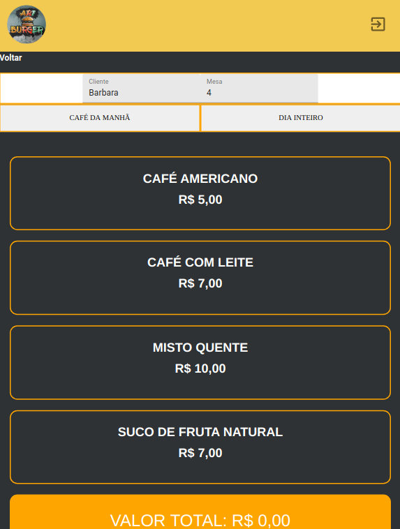
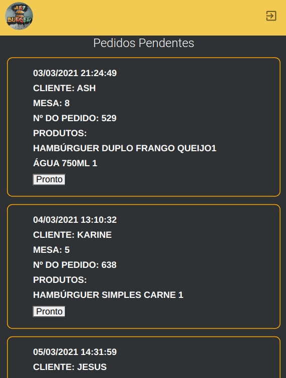

## Art Burguer :hamburger:

ArtBurguer é uma lanchonete 24 horas muito movimentada que precisava de uma aplicação para facilitar o trabalho da sua equipe, criando comunicação direta entre a equipe do salão e a da cozinha no que diz respeito aos pedidos de clientes. 
[**Conheça a aplicação da Art Burguer**](https://art-burger.vercel.app/) :hamburger:
> Status do Projeto: Concluído :heavy_check_mark:

---

## Índice

- [1. Apresentação do Projeto](#1-apresentação-do-projeto)
- [2. Apresentação da aplicação](#2-apresentação-da-aplicação)
- [3. A marca ArtBurguer](#3-a-marca-artburguer)
- [4. Desenvolvimento](#4-desenvolvimento)
- [5. Planejamento](#5-planejamento)
- [6. Linguagens e Ferramentas Utilizadas](#6-linguagens-e-ferramentas-utiizadas)
- [7. Soft Skills aprimoradas](#7-soft-skills-aprimoradas)
- [8. Desenvolvedoras](#8-desenvolvedoras)

---

## 1. Apresentação do projeto

O projeto ArtBurguer foi desenvolvido como parte do Bootcamp da Laboratória. Nos foi apresentada a proposta de projeto no qual deveríamos desenvolver uma aplicação para um restaurante pequeno que precisava automatizar seu sistema de pedidos para facilitar a dinâmica e o trabalho dos garçons, que pegam os pedidos dos clientes, e da equipe da cozinha, que precisa preparar os pedidos de forma organizada para serem entregues aos clientes no tempo adequado. 
Neste projeto começamos a aprender React.Js.

## 2. Apresentação da Aplicação:pencil2:

A aplicação foi desenvolvida com o React.Js. Utilizando o React-Router criou-se uma SPA (single page aplication) de maneira que a navegação na aplicação ficasse mais rápida para o usuário.
>A primeira tela apresentada é a tela de login, que dá a possobilidade de o novo usuário ser redirecionado para a tela de cadastro

>Na tela de cadastro o usuário deve informar se trabalha na cozinha ou no salão, que seriam os garçons

> Os garçons são redirecionados para uma tela de transição quando fazer o login. Nessa tela têm a possibilidade de escolher se vão gerar um novo pedido ou se vão visualizar os pedidos prontos para ser entregues

>Na tela pedidos os garçons podem fazer pedidos escolhendo entre dois cardápios

>A equipe da cozinha quando faz o login na aplicação é redirecionada para a página de pedidos pendentes onde consegue visualizar os pedidos que precisam ser preparados

## 3. A marca ArtBurguer

A marca ArtBuguer pensada para ser uma marca moderna, que dialoga com o público jovem, principal público da hamburgueria. Utilizou-se para isso a identidade visual partindo da arte urbana, representada pelo grafite.
O grafite está presente na logo da marca e também é usado dentro da aplicação para criar uma identidade visual.

---
  
### Paleta de Cores :art:

Partindo da _logo_ da hamburgueria e pensando em criar uma identidade visual, a seguinte paleta de cores foi usada para a execução do projeto: 

## 4. Desenvolvimento :clipboard:

Como ponto de partida para desenvolvimento do projeto foram apresentadas para as desenvolvedoras histórias de usuário que contemplavam as necessidades da equipe do restaurante quanto aos pedidos de clientes. 

### Histórias de usuário :bookmark_tabs:

#### História de usuário 1

>Usuário deve ter seu perfil (login/senha) para acessar o sistema.

Eu como funcionário do restaurante quero entrar na plataforma e ver apenas a tela importante para o meu trabalho.
#### História de usuário 2

> Garçom/Garçonete deve poder anotar o seu pedido

Eu como garçom/garçonete quero poder anotar o meu pedido saber o valor de cada
produto e poder enviar o pedido para a cozinha para ser preparado.
#### História de usuário 3 

>Chefe de cozinha deve ver os pedidos

Eu como chefe de cozinha quero ver os pedidos dos clientes em ordem, poder marcar que estão prontos e poder notificar os garçons/garçonetes que o pedido está pronto para ser entregue ao cliente.
#### História de usuário 4

> Garçom/Garçonete deve ver os pedidos prontos para servir

Eu como garçom/garçonete quero ver os pedidos que estão prontos para entregá-los rapidamente aos clientes.

## 5. Planejamento :memo:

A equipe utilizou a ferramenta _Trello_ para fazer todo o planejamento e organização do projeto.
Se quiser saber um pouco mais sobre o planejamento do projeto, basta acessar nosso quadro através desse  [link](https://trello.com/b/99lItlS2/artburger).

## 6. Linguagens e Ferramentas utilizadas :round_pushpin:

Para o desenvolvimento do projeto utilizamos as seguintes ferramentas: 

:pushpin: HTML e CSS 
:pushpin: Javascript 
:pushpin: React.Js 
:pushpin: Material UI 

## 7. Soft Skills aprimoradas :dart: 

:pushpin: Colaboração 
:pushpin: Trabalho em equipe 
:pushpin: Empatia 
:pushpin: Diálogo entre membros da equipe 
:pushpin: Planejamento

## 8. Desenvolvedoras :computer:

Para conhecer um pouco mais do trabalho das desenvolvedoras responsáveis pela realização desse projeto clique nos nomes delas a seguir:

#### :octocat: [**Karine Frontelli**](https://github.com/KarineFrontelli) 

#### :octocat: [**Rebeca Canesin**](https://github.com/rebecaCanesin)

---